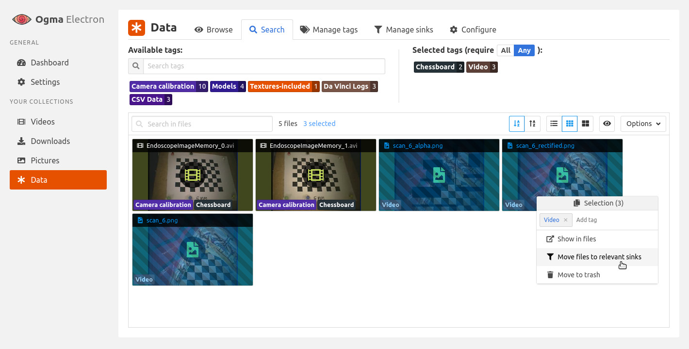

# 👁️ Ogma

File tagging system built on Electron. Includes web view support!




# Building & running

### Cloning

Note that `ogma-frontend/` directory points to [a separate Git repository](https://github.com/TimboKZ/ogma-frontend).
This means this repository has to be cloned with submodules:
```bash
git clone --recursive https://github.com/TimboKZ/Ogma.git

# OR if you already cloned the repo:
git clone https://github.com/TimboKZ/Ogma.git
cd Ogma
git submodule init
git submodule update --recursive
```

### Running in production mode

First, install dependencies for the frontend modules and build it:
```npm
cd ogma-frontend/
npm ci
npm run build
```

Then, go back to root `Ogma/` directory, install Electron dependencies
and run the app in production mode:
```
cd ..
npm ci
npm postinstall
npm run prod
```
Enjoy!

### Running in development mode

Running the app in development mode is useful if you want to change the React code for the frontend and get hot-reloading and real-time updates.

First, make sure all of the native dependencies are rebuilt for the correct Electron version by running:
```bash
npm run postinstall
```

Then start the webpack development server for the frontend:

```bash
cd ogma-frontend/
npm start
```

The webpack server will startup and open the webapp in your browser. The webapp will report some errors - this is
expected, as the backend server is not running yet.

Next, start the Electron app which will run the backend server in the background:
```
cd .. # Go back to repository root
npm start
```

Once the Electron app starts up, you can reload your browser window and the web app should work as intended.
